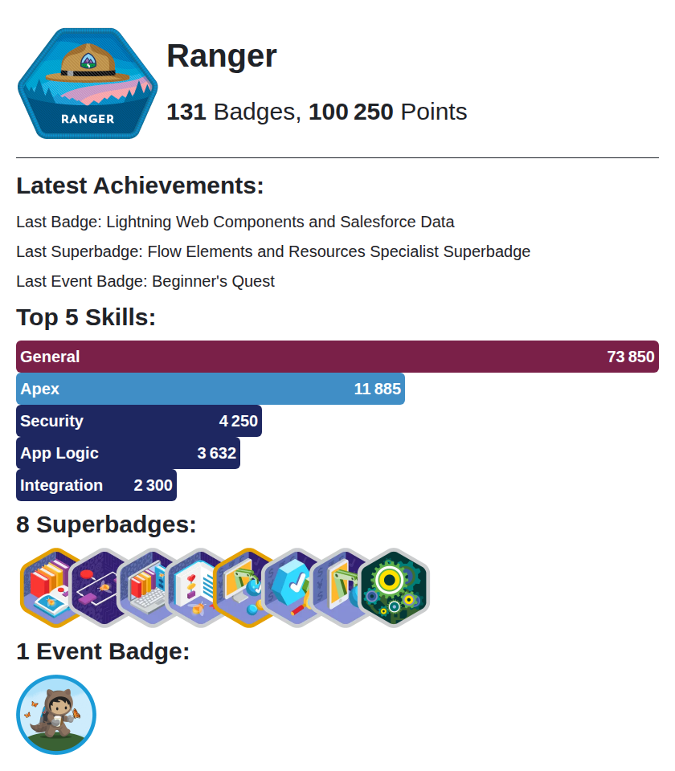

<h1 align="center">Hello, I'm Fergus</h1>
<h3 align="center">Developer @ an Australian NGO<h3></h3>

- Studying Master of Computer Science
- Keen to continue learning through collaboration and feedback

<!--
**F-Joubert/F-Joubert** is a ✨ _special_ ✨ repository because its `README.md` (this file) appears on your GitHub profile.

Here are some ideas to get you started:

- 🔭 I’m currently working on ...
- 🌱 I’m currently learning ...
- 👯 I’m looking to collaborate on ...
- 🤔 I’m looking for help with ...
- 💬 Ask me about ...
- 📫 How to reach me: ...
- 😄 Pronouns: ...
- ⚡ Fun fact: ...
-->

<h2>GitHub Stats</h2>

  
  

<h2>Technologies & Tools</h2>

<h4>Languages</h4>

  

<h4>Frontend Technologies</h4>

  

<h4>Backend Technologies</h4>

  

<h4>OS, IDE, & Other Tools</h4>

  

  

  

<h3>Trailhead Stats</h3>

<!--TH_Stats:start-->

<a href="https://www.salesforce.com/trailblazer/fergusj">
<picture>
    <source media="(prefers-color-scheme: light)" srcset="TScard-light.png">
    <source media="(prefers-color-scheme: dark)" srcset="TScard-dark.png">
    
</picture>
</a>
<!--TH_Stats:end-->

